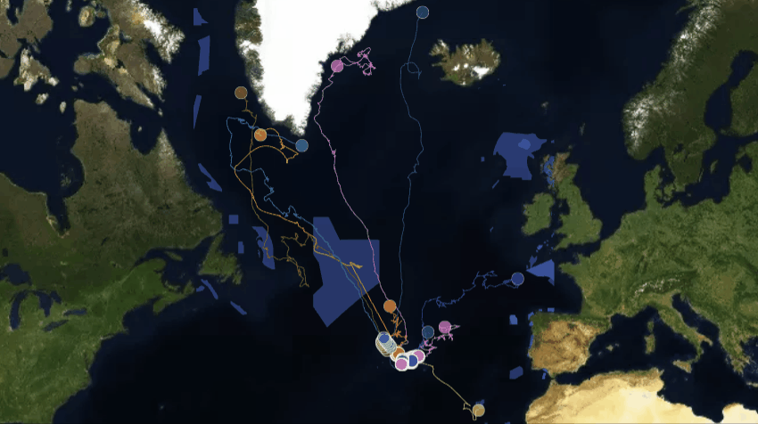

# Map Gallery - 12 month Phytoplankton concentration with Great whales[1] summer migration routes to the Arctic

This map gallery shows the products obtained with the *"Wildlife Tracker for Oceans"* developed for the Blue Cloud Hachathon 2022. The geo-framework is able to connect real time data from Argos satellite for animal tracking and data from Copernicus marine constellation for ocean bio-physic data. 

In this gallery, it is good to enphasise that Blue Cloud provided a relevant data product: **Global ocean 3D Phytoplankton product of Chlorophyll-a concentration as proxy of Phytoplankton biomass[2]** and it is represented as hotspot (>80% percentile) by each month. 

The geo-framework is under development and can be accessed in the next link: ["Wildlife Tracker for Ocean V0.2-BC"](https://share.streamlit.io/gis4-wildlife/wildlife-tracker-oceans-v0.2pro/main/gis4-oceans.py)

If the web-app is broken please notify it so I can fix it and make it available for you. Contact: bryanvallejo16@gmail.com 

Find a video tutorial about how to use the demo: ["Wildlife Tracker for Oceans demo tutorial"](https://www.youtube.com/watch?v=IYN5dCJg6os)

## 1) Marine Wildlife Movements and Marine Protected Areas (MPAs)[3]
Access the webmap in the next link: [Great Whale summer migration movements](https://gis4-wildlife.github.io/phytoplankton-blue-cloud-gallery/root/1_whale_movements_and_marine_areas.html)

