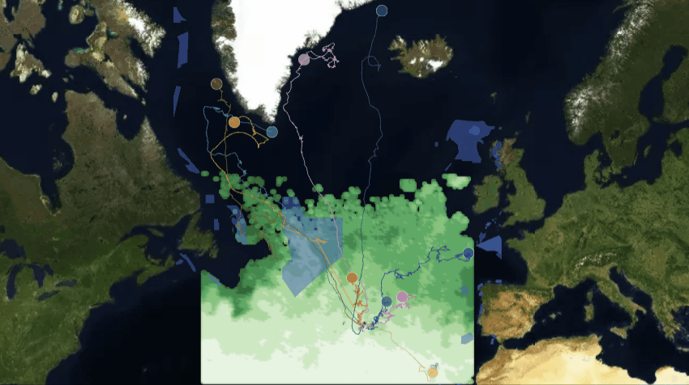
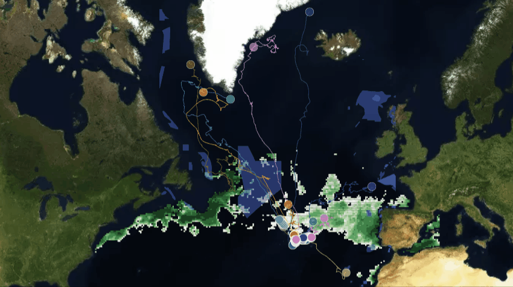
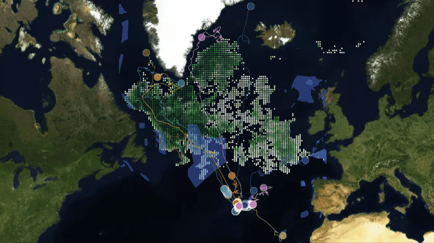
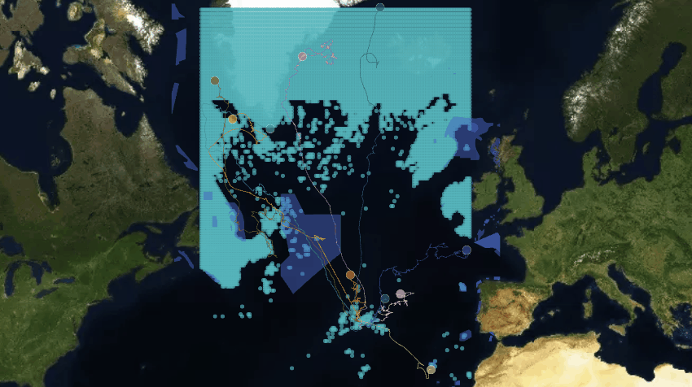

## Map Gallery - 12 month Phytoplankton concentration with Great whales[1] summer migration routes to the Arctic

This map gallery shows the products obtained with the *"Wildlife Tracker for Oceans"* developed for the Blue Cloud Hachathon 2022. The geo-framework is able to connect real time data from Argos satellite for animal tracking and data from Copernicus marine constellation for ocean bio-physic data. 

In this gallery, it is good to enphasise that Blue Cloud provided a relevant data product: **Global ocean 3D Phytoplankton product of Chlorophyll-a concentration as proxy of Phytoplankton biomass[2]** and it is represented as hotspot (>80% percentile) by each month. 

The geo-framework is under development and can be accessed in the next link: ["Wildlife Tracker for Ocean V0.2-BC"](https://share.streamlit.io/gis4-wildlife/wildlife-tracker-oceans-v0.2pro/main/gis4-oceans.py)

If the web-app is broken please notify it so I can fix it and make it available for you. Contact: bryanvallejo16@gmail.com 

Find a video tutorial about how to use the demo: ["Wildlife Tracker for Oceans demo tutorial"](https://www.youtube.com/watch?v=IYN5dCJg6os)

### 1) Demo: Marine Wildlife Movements and Marine Protected Areas (MPAs)[3]
Access the webmap in the next link: [**Great Whales summer migration movements**](https://gis4-wildlife.github.io/PhytoplanktonGallery-BlueCloud/root/1_whale_movements_and_marine_areas.html)

### 2) Product 1: Monthly changes during 2018 of Phytoplankton concentration
Access the webmap in the next link: [**Yearly phytoplankton concentration**](https://gis4-wildlife.github.io/PhytoplanktonGallery-BlueCloud/root/2_whale_trajectories_and_yearly_chla.html)

### 3) Product 2: Hotspots of Phytoplankton concentration overlapped with Great Whales summer migration
Access the January webmap in the next link: [**January phytoplankton hotspots**](https://gis4-wildlife.github.io/PhytoplanktonGallery-BlueCloud/root/index_January_hotspot.html)

Access the June webmap in the next link: [**June phytoplankton hotspots**](https://gis4-wildlife.github.io/PhytoplanktonGallery-BlueCloud/root/index_June_hotspot.html)

**All 12 months of Phytoplankton hotspots**
- [Phytoplankton hotspots on January](https://gis4-wildlife.github.io/PhytoplanktonGallery-BlueCloud/root/index_January_hotspot.html)
- [Phytoplankton hotspots on February](https://gis4-wildlife.github.io/PhytoplanktonGallery-BlueCloud/root/index_February_hotspot.html)
- [Phytoplankton hotspots on March](https://gis4-wildlife.github.io/PhytoplanktonGallery-BlueCloudy/root/index_March_hotspot.html)
- [Phytoplankton hotspots on April](https://gis4-wildlife.github.io/PhytoplanktonGallery-BlueCloud/root/index_April_hotspot.html)
- [Phytoplankton hotspots on May](https://gis4-wildlife.github.io/PhytoplanktonGallery-BlueCloud/root/index_May_hotspot.html)
- [Phytoplankton hotspots on June](https://gis4-wildlife.github.io/PhytoplanktonGallery-BlueCloud/root/index_June_hotspot.html)
- [Phytoplankton hotspots on July](https://gis4-wildlife.github.io/PhytoplanktonGallery-BlueCloud/root/index_July_hotspot.html)
- [Phytoplankton hotspots on August](https://gis4-wildlife.github.io/PhytoplanktonGallery-BlueCloud/root/index_August_hotspot.html)
- [Phytoplankton hotspots on September](https://gis4-wildlife.github.io/PhytoplanktonGallery-BlueCloud/root/index_September_hotspot.html)
- [Phytoplankton hotspots on October](https://gis4-wildlife.github.io/PhytoplanktonGallery-BlueCloud/root/index_October_hotspot.html)
- [Phytoplankton hotspots on November](https://gis4-wildlife.github.io/PhytoplanktonGallery-BlueCloud/root/index_November_hotspot.html)
- [Phytoplankton hotspots on December](https://gis4-wildlife.github.io/PhytoplanktonGallery-BlueCloud/root/index_December_hotspot.html)

### 4) Bonus. Data gaps and whale movements
Access the Data gaps webmap in the next link: [**Data gaps and whale movements**](https://gis4-wildlife.github.io/PhytoplanktonGallery-BlueCloud/root/3_whale_trajectories_and_data_gaps.html)

### 5) References
- [1] [Silva et al (2014). North Atlantic blue and fin whales suspend their spring migration to forage in middle latitudes: building up energy reserves for the journey](https://www.movebank.org/cms/webapp?gwt_fragment=page=studies,path=study72289508)
- [2] [Sauzede et al (2015). Phytoplankton data products from Blue Cloud](https://www.blue-cloud.org/demonstrators/zoo-and-phytoplankton-eov-products)
- [3] [UNEP-WCMC and IUCN (2022), Protected Planet: The World Database on Protected Areas (WDPA) and World Database on Other Effective Area-based Conservation Measures](https://www.protectedplanet.net/en/thematic-areas/wdpa?tab=WDPA)

